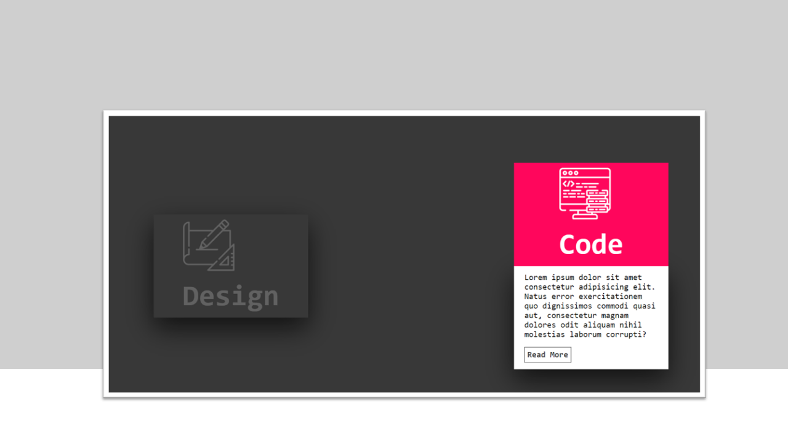

# Card Hover Effect

## 📄 Introdução

Este projeto foi desenvolvido em HTML e CSS, cujo objetivo esta na prática do efeito "Card Hover Effect". Ao passar o mouse, você conseguirá visualizar as informações contidas no card.

[Clique aqui para acessar o projeto](https://projeto-frontendreact-beta.vercel.app/)

## ⚒️ Tecnologias 

## 📫 Contato

E-mail: emidio.daniel@hotmail.com

